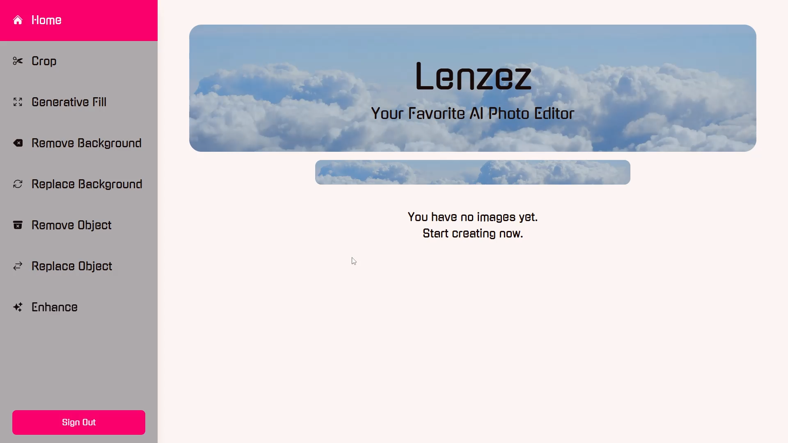
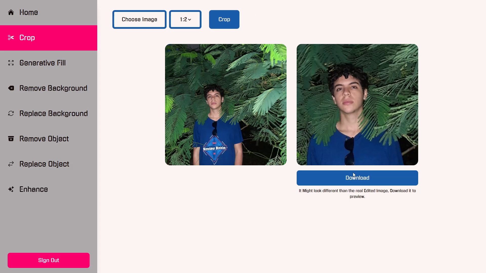
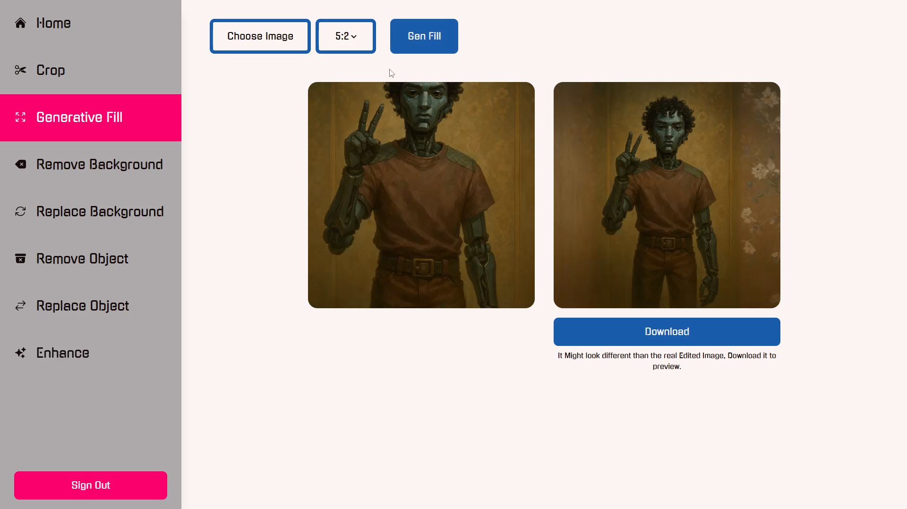
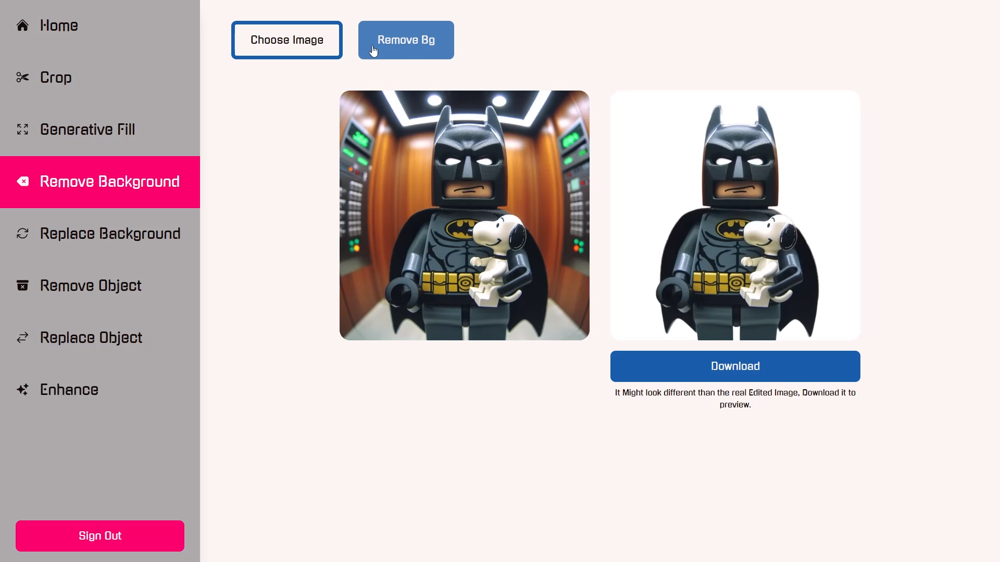
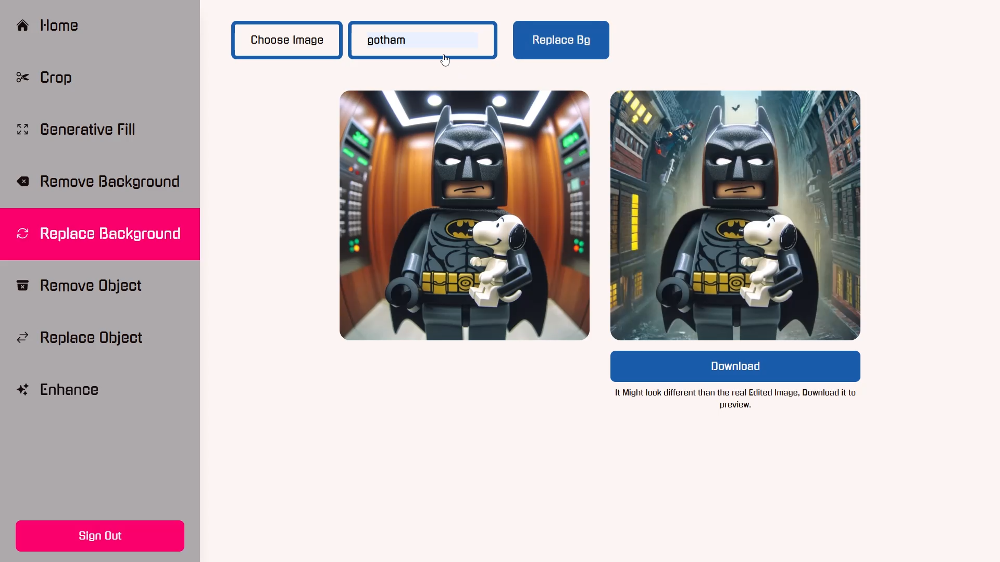
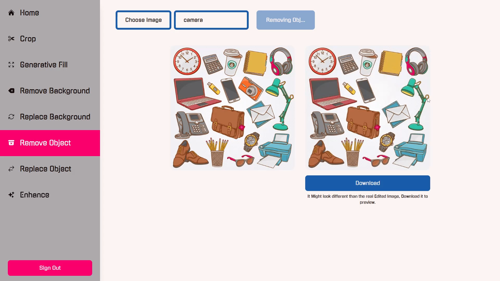
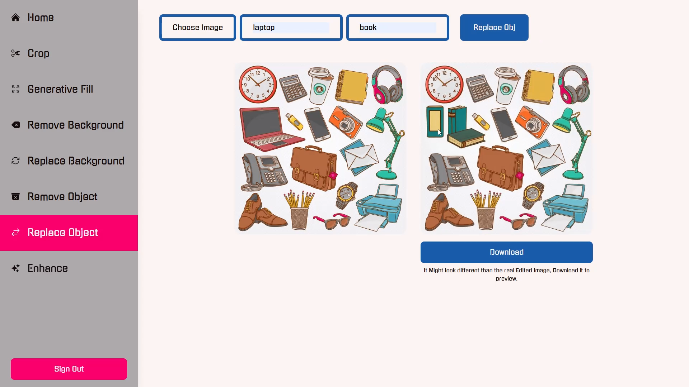
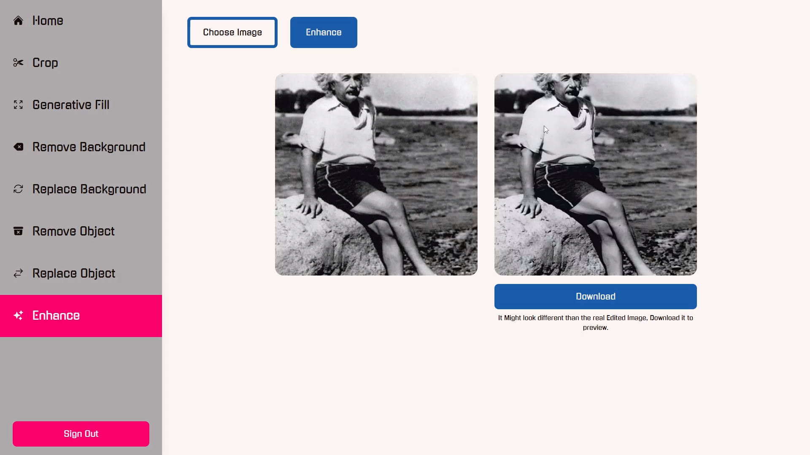
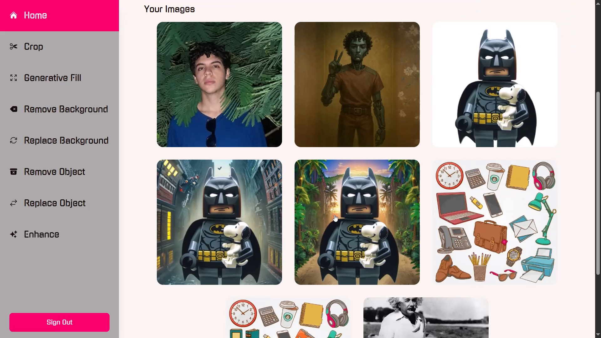

# Lenzez

The **AI-Powered** Photo Editor you need.

You want to edit your images faster, tired of all the paid tools that spam ads on you to make a profit from you without you getting anything.

Then this one is for you: Full **Free** AI-Powered Photo Editor, without any requests from our side.

---

## Links

- [Live Project](lenzez.vercel.app)
- [Source Code](https://github.com/Sam50x/lenzez)

---

## Our Features

- Content-Aware Cropping:

- Generative Fill:

- Remove background:

- Replace background:

- Remove an object:

- Replace an object:

- Enhance:

- All your Images are saved on the cloud:

---

## The Easiest Workflow

- Open **Lenzez**.
- Choose the **service** you want.
- Upload your **image**.
- Download your **edited image**.
- Scroll through all your **edited images**.

All of that is totally **FREE** with **Lenzez.**

---

## Tech-Stack and Tools

- Next.js: The Web Framework for full-stack development.
- Tailwind CSS: Styling.
- TypeScript: Code base main language for type safety.
- Supabase: Cloud Solution for Storage and authentication.
- Cloudinary AI: For Auto Image Editing.

---

## What I brought as a Developer

- Easy looking UI/UX for better user interactivity.
- Fully responsive design that works well on all devices.
- Secure database storage with Supabase.
- Fully functional backend functions for image uploading, editing and storage using the Cloudinary and Supabase APIs.
